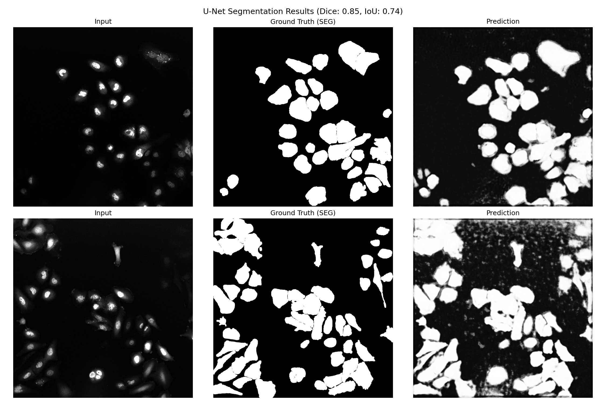
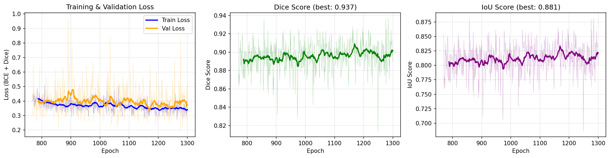
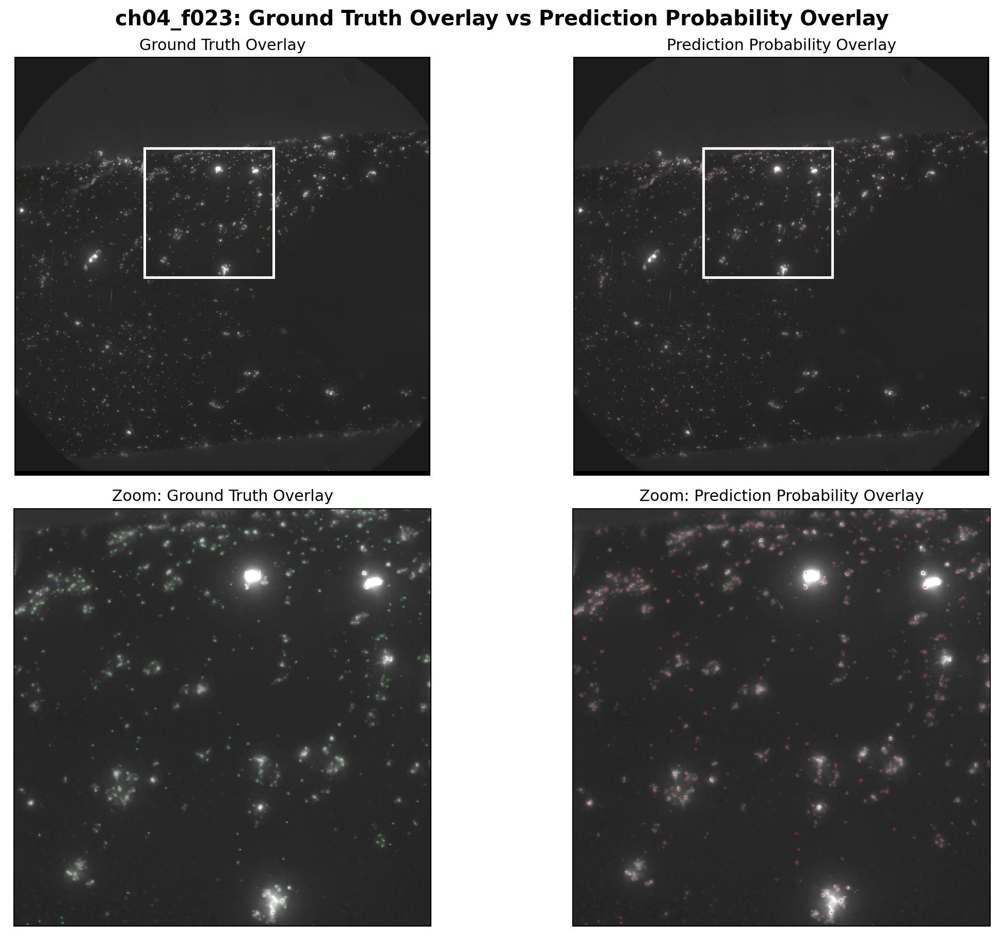

# Universal U-Net Segmentation

[](https://colab.research.google.com/github/Weiykong/universal-unet-segmentation/blob/main/demo.ipynb)
[](LICENSE)
[](https://www.python.org/downloads/release/python-3100/)

A lightweight, configurable U-Net implementation for biological image segmentation. Supports **TIFF, PNG, and JPEG** inputs with acceleration on **Apple Silicon (MPS)** and **CUDA GPUs**.

## Results

Trained on the [Fluo-C2DL-Huh7](https://celltrackingchallenge.net/2d-datasets/) dataset (human hepatocarcinoma cells, fluorescence microscopy) with only **13 annotated images**:

| Metric | Best | Mean (last 50 epochs) |
|--------|------|-----------------------|
| **Dice** | 0.937 | 0.898 |
| **IoU** | 0.881 | 0.815 |

### Segmentation Examples



*Columns: Input image, Ground truth mask, Model prediction, Overlay (green = correct, red = false positive, blue = missed)*

### Training Curves



*Loss (BCE + Dice), Dice score, and IoU over 1300 epochs. Model converges around epoch 800, with best checkpoint at epoch 1275 (val_loss = 0.193).*

### 1 um Fluorescent Bead Outcome

The same U-Net was also trained on a custom **1 um fluorescent bead** dataset with **109 annotated image/mask pairs**. Using the default `depth=4`, `base_features=64` configuration for **200 epochs**, the run completed successfully and the best checkpoint reached:

| Metric | Outcome |
|---|---|
| Best validation loss | **0.6435** |
| Final checkpoint epoch | **199** |
| Best checkpoint epoch | **185** |

For a held-out qualitative check on `ch04_f023`, the saved best model produced:

| Sample | Dice | IoU |
|---|---|---|
| `ch04_f023` | **0.780** | **0.639** |



*Top row: ground-truth mask overlay vs prediction-probability overlay on `ch04_f023`. Bottom row: matched zoom of the densest bead region.*

## Features

- **Configurable architecture** — adjustable depth (2-6 levels) and feature width
- **Multi-format support** — TIFF, PNG, and JPEG for images and masks
- **Combined BCE + Dice loss** — directly optimizes segmentation overlap
- **Cosine annealing LR** — smooth learning rate decay with configurable minimum
- **Rich data augmentation** — flips, rotations, elastic deformation, intensity jitter, Gaussian noise/blur
- **Best-model checkpointing** — saves model with lowest validation loss
- **Resume training** — continue from any checkpoint with `--resume`
- **TensorBoard logging** — real-time training curves
- **Dropout regularization** — in bottleneck and adjacent levels to reduce overfitting
- **Cross-platform** — CPU, CUDA, and Apple Silicon (MPS)

## Quick Start

### 1. Installation

```bash
git clone https://github.com/Weiykong/universal-unet-segmentation.git
cd universal-unet-segmentation
pip install -r requirements.txt
```

### 2. Try the Demo (No Installation Required)

Click the **"Open in Colab"** badge above to launch a live Jupyter Notebook that will:
1. Clone the code on a remote cloud server
2. Generate synthetic test data
3. Run the model and visualize the results instantly

## Usage Guide

### Training

1. Place your images in `data/images/` and binary masks in `data/masks/`
2. Run:

```bash
python src/train.py --epochs 500 --batch_size 4 --lr 1e-4 --augment --depth 4 --crop_size 512
```

**Arguments:**

| Argument | Default | Description |
|---|---|---|
| `--epochs` | 50 | Number of training epochs |
| `--batch_size` | 4 | Batch size |
| `--lr` | 1e-4 | Initial learning rate |
| `--val_split` | 0.2 | Fraction of data for validation |
| `--augment` | off | Enable data augmentation |
| `--depth` | 4 | U-Net encoder depth (2-6) |
| `--base_features` | 64 | Features in first layer (doubles each level) |
| `--crop_size` | 512 | Random crop size during training |
| `--resume` | — | Path to checkpoint to resume from |

**Architecture presets:**

| Preset | Command | Params | Best for |
|---|---|---|---|
| Lightweight | `--depth 3 --base_features 32` | 0.47M | Small datasets, fast training |
| Default | `--depth 4 --base_features 64` | 7.70M | General-purpose segmentation |
| Deep | `--depth 5 --base_features 64` | 30.8M | Complex structures, large datasets |

### Resume Training

Continue training from a saved checkpoint:

```bash
python src/train.py --epochs 1000 --batch_size 4 --augment --resume models/best_model.pth
```

The optimizer state, learning rate schedule, and best validation loss are all restored.

### Monitoring with TensorBoard

```bash
tensorboard --logdir runs
```

### Inference

1. Place new images in `data/inference_input/`
2. Run:

```bash
python src/inference.py
```

Results are saved as probability maps in `output/`. The model architecture is auto-detected from the checkpoint.

## Project Structure

```text
universal-unet-segmentation/
├── data/
│   ├── images/            # Raw input images (TIFF/PNG/JPEG)
│   ├── masks/             # Ground truth binary masks
│   └── inference_input/   # New images to segment
├── models/                # Saved model weights (.pth)
├── output/                # Segmentation probability maps
├── runs/                  # TensorBoard logs
├── src/
│   ├── model.py           # Configurable U-Net architecture
│   ├── train.py           # Training (full-image with random crops)
│   ├── train_crop.py      # Training (smaller crop variant)
│   ├── inference.py       # Prediction logic
│   └── compare.py         # Generate comparison visualizations
├── preprocess_ctc.py      # Cell Tracking Challenge dataset converter
├── run.py                 # Pipeline entry point
├── demo.ipynb             # Colab demo notebook
└── requirements.txt       # Dependencies
```

## Requirements

| Dependency | Version |
|---|---|
| Python | 3.10+ |
| PyTorch | >= 2.0.0 (required for MPS) |
| Key libraries | tifffile, numpy, tqdm, tensorboard, Pillow |

```bash
pip install -r requirements.txt
```

## Reproducing Results

To reproduce the Fluo-C2DL-Huh7 results shown above:

1. Download the training dataset from the [Cell Tracking Challenge](https://celltrackingchallenge.net/2d-datasets/) (Fluo-C2DL-Huh7, 36 MB)
2. Run the preprocessing script to convert SEG masks to binary:

```bash
python preprocess_ctc.py
```

3. Train (1300 epochs, ~6 hours on Apple M-series):

```bash
python src/train.py --epochs 1300 --batch_size 4 --lr 1e-4 --augment --depth 4 --crop_size 512
```

## License

This project is licensed under the MIT License — see the [LICENSE](LICENSE) file for details.

## Author

GitHub: [@Weiykong](https://github.com/Weiykong)
